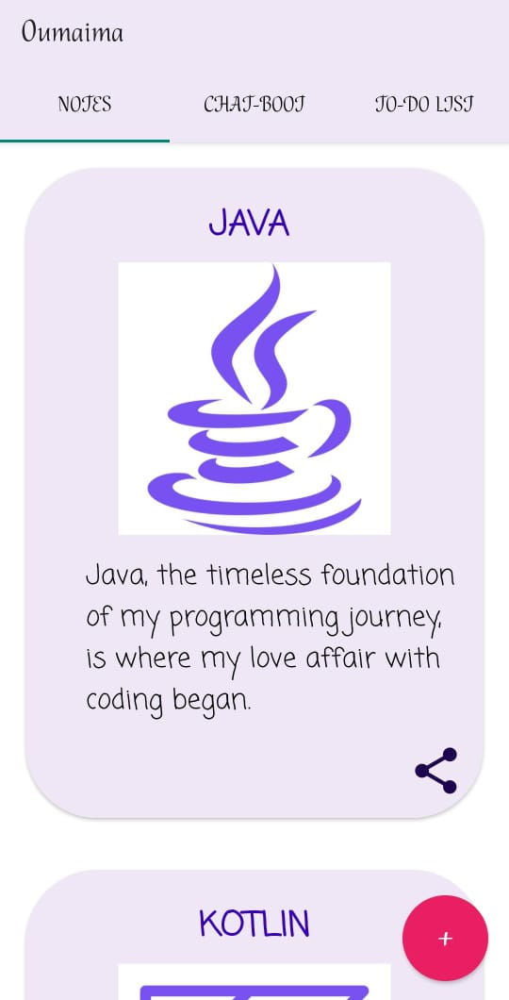
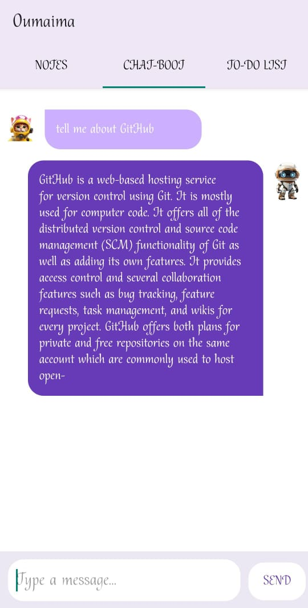
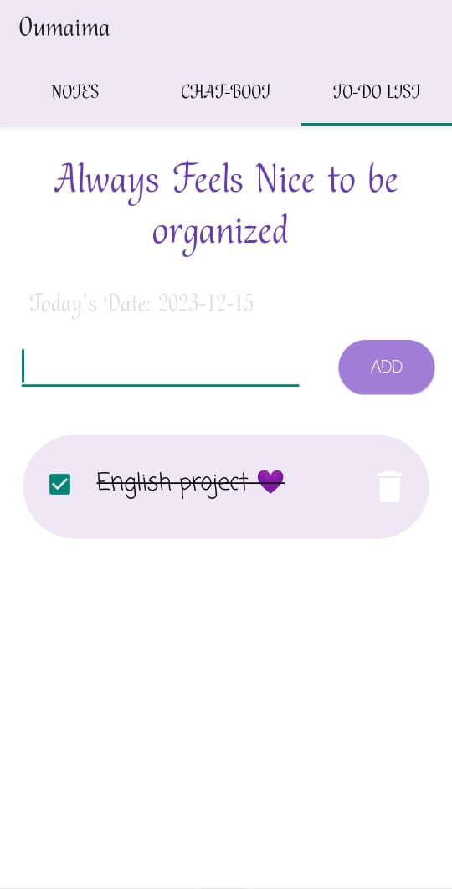

# Oumnou_Journey App

## Overview

Oumnou_Journey is a comprehensive mobile application designed to enhance the academic journey for students. This app is built using Kotlin and Android Studio, utilizing the ChatGPT API for a chatbot feature. Oumnou allows students to write and organize their notes, attach photos to their entries, engage in conversation with a chatbot powered by OpenAI's ChatGPT, and manage their tasks with a convenient to-do list.

## Features

1. **Note Taking:**
   - Easily write and organize your study notes within the app.
   - Attach photos to your notes for visual reference.

2. **Chatbot Assistance:**
   - Access a chatbot powered by OpenAI's ChatGPT for academic queries and assistance.
   - Engage in natural language conversations to get information and support.

3. **Todo List:**
   - Keep track of your tasks and assignments with a user-friendly to-do list.
   - Set deadlines and mark tasks as completed to stay organized.


## Getting Started

To run the Oumnou app locally, follow these steps:

1. Clone the repository to your local machine:

   ```bash
   git clone https://github.com/oumnou/oumnou.git

## Dependencies
  - Kotlin: The programming language used for app development.
  - Android Studio: The official integrated development environment (IDE) for Android app development.
  - ChatGPT API: OpenAI's API for integrating natural language processing and chatbot capabilities into the app.

## Contributions
Contributions to Oumnou_Journey are welcome! If you have any ideas for improvements or new features, feel free to open an issue or submit a pull request.

## Acknowledgments
- Special thanks to OpenAI for providing the ChatGPT API.
- Thanks to the Kotlin and Android Studio communities for their support.
- Happy learning and organizing your academic journey with Oumnou!

## Screens





